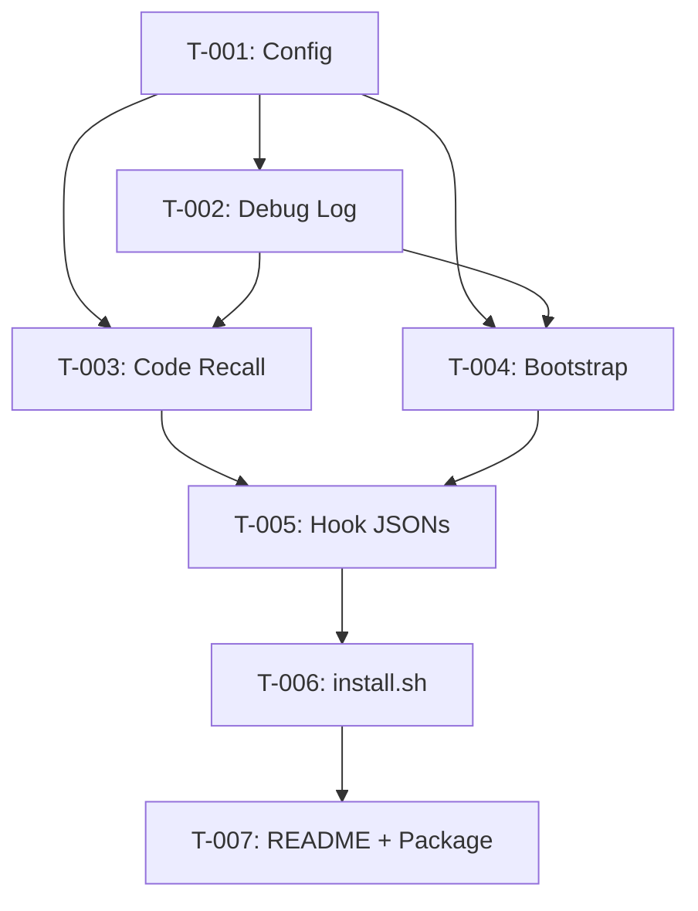

# TASK-GUIDE — semble-hooks

## Overview
Code-Intelligence Hooks für AI Coding CLIs. 7 Tasks, 4 Phasen. Geschätzter Gesamtaufwand: 3-5 Tage.

## Phase Breakdown

### Phase 1: Foundation
Config, Logging, Grundstruktur. Keine externe Dependencies.

### Phase 2: Core Hooks
code-recall.mjs und code-bootstrap.mjs — die eigentliche Funktionalität.

### Phase 3: Integration
Hook-Definitionen pro CLI und Installer.

### Phase 4: Polish
README, CONTRIBUTING, Tests.

## Tasks

### T-001: Config System (config.mjs)
- **Phase:** 1
- **What to build:** Config-Loader der ~/.semble-hooks/config.json liest. ENV-Override für Config-Pfad. Defaults für topK, semblePath, timeout, debug, excludePatterns. Validierung mit Clamping.
- **Files to create:** `scripts/config.mjs`
- **Dependencies:** none
- **Definition of Done:**
  - [ ] `loadConfig()` gibt Config-Objekt zurück
  - [ ] Defaults funktionieren ohne Config-Datei (kein Error)
  - [ ] ENV SEMBLE_HOOKS_CONFIG überschreibt Pfad
  - [ ] topK wird auf 1-20 geclampt
  - [ ] timeout wird auf 1000-30000 geclampt
- **Effort:** S (1-2d)
- **Spawn-Prompt:**
  ```
  SCOPE: Config-Loader für semble-hooks. JSON Config mit Defaults und ENV-Override.
  OBJECTIVE: Baue scripts/config.mjs — ein Config-Modul das ~/.semble-hooks/config.json liest, sinnvolle Defaults hat, und ENV-Overrides erlaubt. Pattern: DREVIHO config.mjs.
  CONTEXT:
    Project: <project-root>
    Read first: CLAUDE.md, PRD.md (F-004)
    Tech: Node.js ESM (.mjs), keine Dependencies
    Reference: https://github.com/benediktkraus/dreviho/scripts/config.mjs
  EXISTING CODE: Nichts — erster Task.
  FORBIDDEN:
    - Do NOT use npm packages
    - Do NOT use CommonJS (require)
    - Do NOT hardcode paths
    - Do NOT create ~/.semble-hooks/config.json automatisch (nur lesen, Defaults wenn nicht da)
  DELIVERABLES:
    - scripts/config.mjs — loadConfig() Export
  DoD:
    - [ ] loadConfig() gibt Config-Objekt zurück
    - [ ] Funktioniert ohne Config-Datei (Defaults)
    - [ ] ENV SEMBLE_HOOKS_CONFIG überschreibt Pfad
    - [ ] Validierung: topK 1-20, timeout 1000-30000
  ```

### T-002: Debug Logging (debug-log.mjs)
- **Phase:** 1
- **What to build:** Strukturierter JSON-Lines Logger. Aktiviert via ENV oder Config. Zero-cost no-ops wenn deaktiviert. Exakt wie DREVIHO debug-log.mjs aber mit eigenem Namespace.
- **Files to create:** `scripts/debug-log.mjs`
- **Dependencies:** [T-001]
- **Definition of Done:**
  - [ ] `createLogger("hook-name")` gibt `{log, logError}` zurück
  - [ ] Debug=false → log/logError sind no-ops
  - [ ] Debug=true → JSON Lines nach ~/.semble-hooks/logs/hooks.log
  - [ ] Format: `{ts, hook, stage, data}` oder `{ts, hook, stage, error}`
- **Effort:** S (1-2d)
- **Spawn-Prompt:**
  ```
  SCOPE: Debug Logger für semble-hooks. JSON Lines Format.
  OBJECTIVE: Baue scripts/debug-log.mjs — ein Logger-Modul das strukturierte JSON Lines schreibt wenn Debug aktiv ist, sonst zero-cost no-ops. Kopiere das Pattern von DREVIHO.
  CONTEXT:
    Project: <project-root>
    Read first: CLAUDE.md, scripts/config.mjs (T-001 muss fertig sein)
    Tech: Node.js ESM (.mjs), keine Dependencies
    Reference: https://github.com/benediktkraus/dreviho/scripts/debug-log.mjs
  EXISTING CODE: scripts/config.mjs (T-001)
  FORBIDDEN:
    - Do NOT use npm packages (kein winston, kein pino)
    - Do NOT import from DREVIHO — eigene Implementierung
  DELIVERABLES:
    - scripts/debug-log.mjs — createLogger(hookName) Export
  DoD:
    - [ ] createLogger() gibt {log, logError} zurück
    - [ ] no-ops wenn debug=false
    - [ ] JSON Lines wenn debug=true
  ```

### T-003: Code Recall Hook (code-recall.mjs)
- **Phase:** 2
- **What to build:** Haupthook. Liest User-Prompt von stdin, ruft `semble search` via execFileSync, parsed Output, injiziert als `<relevant-code>`. Graceful degradation bei allen Fehlerfällen.
- **Files to create:** `scripts/code-recall.mjs`
- **Dependencies:** [T-001, T-002]
- **Definition of Done:**
  - [ ] Liest stdin JSON `{prompt}`, ruft semble search
  - [ ] Parsed Semble Markdown-Output (Datei, Zeilen, Score, Code)
  - [ ] Gibt `<relevant-code>` Block als additionalContext zurück
  - [ ] Graceful: semble nicht da → approve ohne Context
  - [ ] Graceful: Prompt <3 Zeichen → approve ohne Search
  - [ ] Graceful: Timeout → approve ohne Context
  - [ ] Graceful: Kein Ergebnis → approve ohne Context
  - [ ] execFileSync mit Array-Args (kein execSync)
  - [ ] Timeout max 8s
- **Effort:** M (3-5d)
- **Spawn-Prompt:**
  ```
  SCOPE: Code-Recall Hook — Kernstück von semble-hooks. Injiziert relevanten Code-Context in AI Prompts.
  OBJECTIVE: Baue scripts/code-recall.mjs — ein UserPromptSubmit Hook der den User-Prompt von stdin liest, `semble search` aufruft, den Output parsed, und als <relevant-code> Block zurückgibt. Muss bei JEDEM Fehlerfall graceful approve ohne Context zurückgeben.
  CONTEXT:
    Project: <project-root>
    Read first: CLAUDE.md, PRD.md (F-001), specs/temporal-flow.md (Flow 1)
    Tech: Node.js ESM (.mjs), child_process.execFileSync
    Semble CLI: semble v0.2.0 (pip install semble)
    Semble Output Format: Markdown mit "## N. file:lines [score=X]" + fenced code block
    Reference: https://github.com/benediktkraus/dreviho/scripts/auto-recall.mjs (Hook I/O Pattern)
  EXISTING CODE: scripts/config.mjs, scripts/debug-log.mjs
  FORBIDDEN:
    - Do NOT use execSync — only execFileSync with array args
    - Do NOT use npm packages
    - Do NOT call any HTTP API
    - Do NOT use <relevant-memories> tag — use <relevant-code>
    - Do NOT touch DREVIHO files
  DELIVERABLES:
    - scripts/code-recall.mjs — standalone Hook Script
  DoD:
    - [ ] echo '{"prompt":"hook pattern"}' | node scripts/code-recall.mjs gibt JSON mit relevant-code zurück
    - [ ] Graceful bei: semble missing, short prompt, timeout, no results, parse error
    - [ ] execFileSync mit Array-Args
    - [ ] Timeout ≤8s
  ```

### T-004: Session Bootstrap (code-bootstrap.mjs)
- **Phase:** 2
- **What to build:** SessionStart Hook. Prüft ob semble installiert ist, führt Warmup-Search aus um Index zu cachen. Kein additionalContext — nur Logging.
- **Files to create:** `scripts/code-bootstrap.mjs`
- **Dependencies:** [T-001, T-002]
- **Definition of Done:**
  - [ ] Prüft semble-Binary (which oder Config-Pfad)
  - [ ] Führt Warmup aus: `semble search "main" . -k 1`
  - [ ] Loggt: Semble gefunden/nicht, Version, Warmup-Dauer
  - [ ] Gibt `{decision: "approve"}` zurück (kein additionalContext)
  - [ ] Graceful: semble nicht da → approve, geloggt
  - [ ] Timeout max 120s
- **Effort:** S (1-2d)
- **Spawn-Prompt:**
  ```
  SCOPE: Session Bootstrap Hook — wärmt Semble-Index beim Session-Start auf.
  OBJECTIVE: Baue scripts/code-bootstrap.mjs — ein SessionStart Hook der prüft ob semble installiert ist und einen Warmup-Search ausführt. Kein Context-Injection, nur Logging.
  CONTEXT:
    Project: <project-root>
    Read first: CLAUDE.md, PRD.md (F-002), specs/temporal-flow.md (Flow 2)
    Tech: Node.js ESM (.mjs), child_process.execFileSync
  EXISTING CODE: scripts/config.mjs, scripts/debug-log.mjs, scripts/code-recall.mjs
  FORBIDDEN:
    - Do NOT inject additionalContext — nur approve
    - Do NOT use execSync
  DELIVERABLES:
    - scripts/code-bootstrap.mjs — standalone Hook Script
  DoD:
    - [ ] Prüft semble-Binary
    - [ ] Warmup-Search ausgeführt
    - [ ] Graceful wenn semble fehlt
    - [ ] Gibt {decision: "approve"} zurück
  ```

### T-005: Hook Definitions (hooks/*.json)
- **Phase:** 3
- **What to build:** JSON Hook-Definitionen pro CLI. Korrekte Pfad-Variablen, Timeouts, Event-Names.
- **Files to create:** `hooks/claude-code.json`, `hooks/codex-cli.json`, `hooks/gemini-cli.json`
- **Dependencies:** [T-003, T-004]
- **Definition of Done:**
  - [ ] claude-code.json: UserPromptSubmit → code-recall.mjs (8s), SessionStart → code-bootstrap.mjs (120s)
  - [ ] codex-cli.json: UserPromptSubmit → code-recall.mjs (8000ms)
  - [ ] gemini-cli.json: BeforeAgent → code-recall.mjs (8000ms)
  - [ ] Pfad-Variablen korrekt pro CLI
- **Effort:** S (1-2d)
- **Spawn-Prompt:**
  ```
  SCOPE: Hook JSON Definitionen für 3 CLIs.
  OBJECTIVE: Erstelle hooks/claude-code.json, hooks/codex-cli.json, hooks/gemini-cli.json mit den korrekten Event-Names, Script-Pfaden und Timeouts pro CLI.
  CONTEXT:
    Project: <project-root>
    Read first: CLAUDE.md, PRD.md (F-003)
    Reference: https://github.com/benediktkraus/dreviho/hooks/ (alle 3 JSON-Dateien)
  EXISTING CODE: scripts/code-recall.mjs, scripts/code-bootstrap.mjs
  FORBIDDEN:
    - Do NOT add Stop/AfterAgent hooks (keine Capture-Funktionalität)
    - Do NOT reference DREVIHO scripts
  DELIVERABLES:
    - hooks/claude-code.json
    - hooks/codex-cli.json
    - hooks/gemini-cli.json
  DoD:
    - [ ] Alle 3 Dateien valides JSON
    - [ ] Events und Timeouts korrekt pro CLI
  ```

### T-006: Installer (install.sh)
- **Phase:** 3
- **What to build:** Multi-CLI Installer. Kopiert Scripts, erstellt Config, registriert Hooks. Pattern von DREVIHO install.sh.
- **Files to create:** `install.sh`
- **Dependencies:** [T-005]
- **Definition of Done:**
  - [ ] `./install.sh claude-code` installiert für Claude Code
  - [ ] `./install.sh codex` installiert für Codex CLI
  - [ ] `./install.sh gemini` installiert für Gemini CLI
  - [ ] `./install.sh all` installiert für alle
  - [ ] Prüft ob semble installiert ist (Warnung wenn nicht)
  - [ ] Erstellt ~/.semble-hooks/ mit Scripts und Default-Config
  - [ ] Idempotent: mehrfach ausführbar ohne Probleme
- **Effort:** M (3-5d)
- **Spawn-Prompt:**
  ```
  SCOPE: Multi-CLI Installer für semble-hooks.
  OBJECTIVE: Baue install.sh — ein Bash-Script das semble-hooks für Claude Code, Codex CLI und Gemini CLI installiert. Kopiert Scripts, erstellt Config, registriert Hooks.
  CONTEXT:
    Project: <project-root>
    Read first: CLAUDE.md, PRD.md (F-006)
    Reference: https://github.com/benediktkraus/dreviho/install.sh
  EXISTING CODE: scripts/*.mjs, hooks/*.json
  FORBIDDEN:
    - Do NOT install OpenViking or DREVIHO
    - Do NOT modify existing CLI configs destructively
    - Do NOT use sudo
  DELIVERABLES:
    - install.sh — executable Bash script
  DoD:
    - [ ] ./install.sh all läuft ohne Fehler
    - [ ] ~/.semble-hooks/ existiert mit Scripts und Config
    - [ ] Idempotent
    - [ ] Warnt wenn semble nicht installiert
  ```

### T-007: README + Package Files
- **Phase:** 4
- **What to build:** GitHub-taugliche README mit Install-Anleitung, Usage, Badges. package.json mit Metadaten. LICENSE. .gitignore aktualisieren.
- **Files to create:** `README.md`, `package.json`, `LICENSE`, `CONTRIBUTING.md`
- **Dependencies:** [T-006]
- **Definition of Done:**
  - [ ] README.md: Was ist es, Install, Usage, Config, Troubleshooting
  - [ ] package.json: name, version, description, license, repository, engines
  - [ ] LICENSE: Apache-2.0 Volltext
  - [ ] CONTRIBUTING.md: Kurzer Guide
  - [ ] .gitignore aktualisiert
- **Effort:** S (1-2d)
- **Spawn-Prompt:**
  ```
  SCOPE: README und OSS-Dateien für GitHub.
  OBJECTIVE: Erstelle README.md (Install, Usage, Config, Badges), package.json (Metadaten), LICENSE (Apache-2.0), CONTRIBUTING.md.
  CONTEXT:
    Project: <project-root>
    Read first: CLAUDE.md, PRD.md, install.sh
    Reference: https://github.com/benediktkraus/dreviho/README.md
  EXISTING CODE: Alle Scripts, Hooks, install.sh
  FORBIDDEN:
    - Do NOT add npm dependencies
    - Do NOT create build scripts
  DELIVERABLES:
    - README.md, package.json, LICENSE, CONTRIBUTING.md
  DoD:
    - [ ] README hat Install-Anleitung die funktioniert
    - [ ] package.json hat korrekte Metadaten
    - [ ] LICENSE ist Apache-2.0 Volltext
  ```

## Dependency Graph



## Effort Summary

| Phase | Tasks | Effort | Calendar estimate |
|-------|-------|--------|------------------|
| 1 — Foundation | T-001, T-002 | 2-4d | Tag 1 |
| 2 — Core Hooks | T-003, T-004 | 4-7d | Tag 1-2 |
| 3 — Integration | T-005, T-006 | 3-7d | Tag 2-3 |
| 4 — Polish | T-007 | 1-2d | Tag 3 |
| **Total** | **7** | **10-20d** | **3 Tage** |
